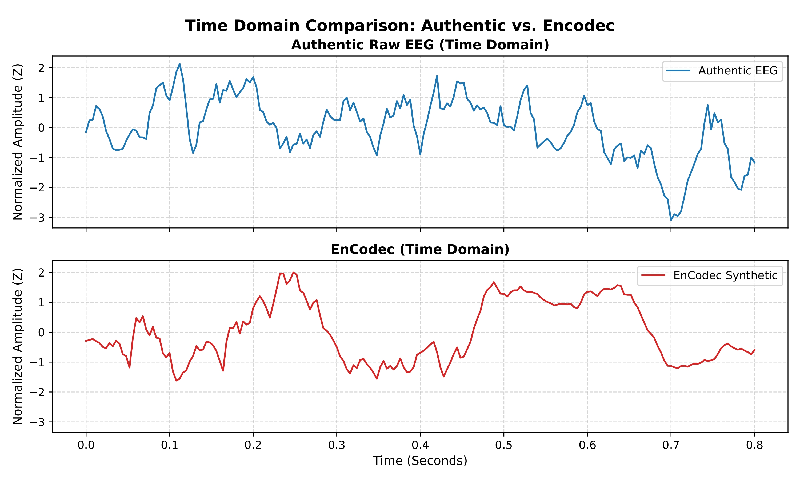
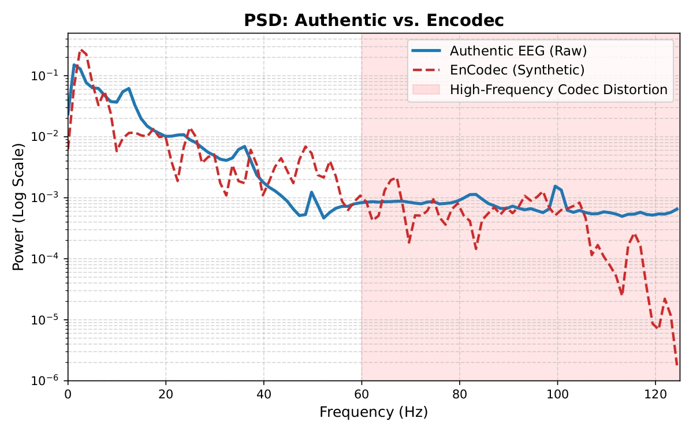
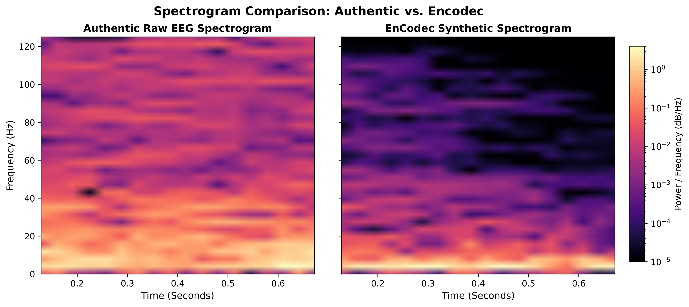
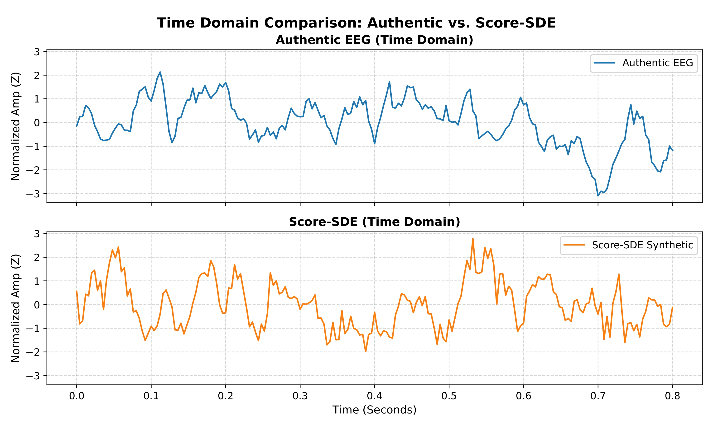
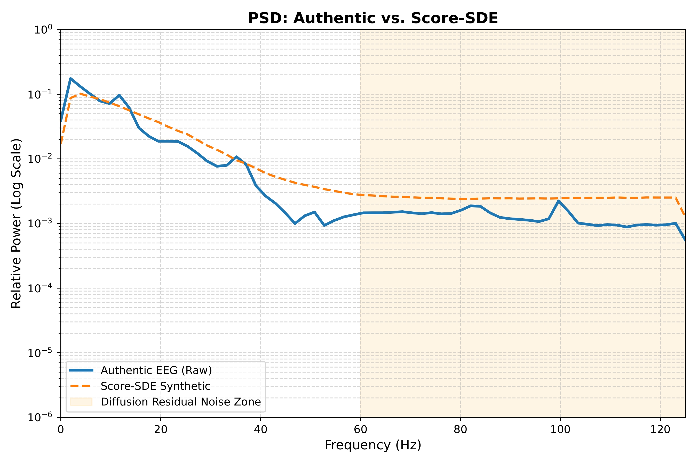
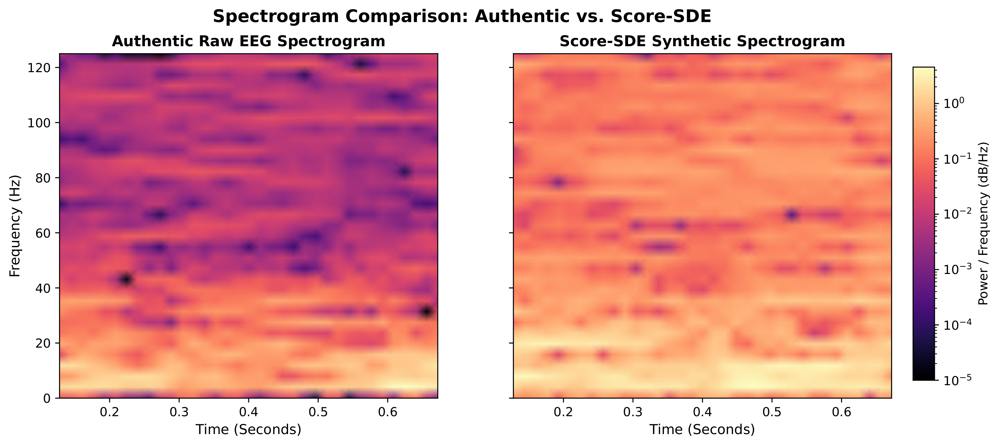
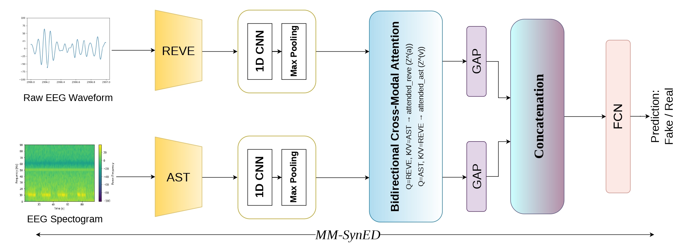

# EEGFakeBench: A Benchmark Dataset for Synthetic EEG Detection


---

> **EEGFakeBench: A Benchmark Dataset for Synthetic EEG Detection**
> Bhavinkumar Vinodbhai Kuwar, Nitin Choudhury, Rajesh Sharma, Arun Balaji Buduru, Orchid Chetia Phukan
> *ACM Multimedia 2026 — Dataset Track*

---

## Dataset Access

| Mirror | Link | Status |
|---|---|---|
| 🤗 HuggingFace (Primary) | [EEGFakeBench on HuggingFace](https://huggingface.co/datasets/Bhuvii19/EEGFakeBench) | ✅ Available |
| Google Drive (Backup) | [EEGFakeBench on Drive](https://drive.google.com/drive/folders/1FqMTwrlL7UigABuQ0_r6Ji3Uta6bzZu9?usp=sharing) | ✅ Available |


---

## Overview

**EEGFakeBench** is the first comprehensive multi-generator benchmark dataset for **Synthetic EEG Detection (SynED)** — the task of detecting fully generative spoofing in EEG signals. Modern generative models can now synthesize EEG signals that are perceptually indistinguishable from genuine neural recordings, posing a serious threat to EEG-based multimedia systems such as biometric authentication, extended reality (XR), and neural gaming.

EEGFakeBench comprises **89,586 EEG recordings** — 9,954 authentic signals paired with 79,632 synthetic signals generated across **8 distinct generative model families** — enabling systematic evaluation of detector generalization under realistic conditions where the synthesis method is unknown at inference time.

---

## Dataset Statistics

| Split | Recordings | Source |
|---|---|---|
| Real (Authentic) | 9,954 | EEGMMIDB (109 subjects) |
| Synthetic — GAN | 19,908 | WGAN (9,954) + TimeGAN (9,954) |
| Synthetic — Diffusion | 9,954 | DS-DDPM |
| Synthetic — Score-Based | 9,954 | Score-SDE |
| Synthetic — NAC | 39,816 | EnCodec + DAC + SoundStream + SNAC (9,954 each) |
| **Total** | **89,586** | |

Each recording is a matrix of shape **(1000 timesteps × 22 channels)** at 250 Hz.

---

## Directory Structure

```
EEGFakeBench/
│
├── real/                               ← All authentic preprocessed EEG trials (flat directory)
│   ├── preprocessed_real_1.csv         ← Subject 1
│   ├── preprocessed_real_2.csv
│   ├── ...
│   └── preprocessed_real_109.csv       ← Subject 109
│
└── EEGFakeBench_Generators/            ← All synthetic EEG, sorted by generative paradigm
    │
    ├── GAN/                            ← Adversarial generative models
    │   ├── timegan_EEGMMIDB_1.csv
    │   ├── timegan_EEGMMIDB_2.csv
    │   ├── ...
    │   ├── wgan_EEGMMIDB_1.csv
    │   └── wgan_EEGMMIDB_109.csv
    │
    ├── Diffusion/                      ← Denoising diffusion models
    │   ├── ddpm_EEGMMIDB_1.csv
    │   └── ...
    │
    ├── score/                          ← Score-based continuous-time models
    │   ├── scoresde_EEGMMIDB_1.csv
    │   └── ...
    │
    └── NACs/                           ← Neural Audio Codec encode-decode pipelines
        ├── encodec_EEGMMIDB_1.csv
        ├── dac_EEGMMIDB_1.csv
        ├── soundstream_EEGMMIDB_1.csv
        ├── snac_EEGMMIDB_1.csv
        └── ...
```

---

## Naming Convention

All files follow a strict, zero-padding-free convention:

| Type | Format | Example |
|---|---|---|
| Authentic | `preprocessed_real_[subject_id].csv` | `preprocessed_real_54.csv` |
| Synthetic | `[generator]_EEGMMIDB_[subject_id].csv` | `snac_EEGMMIDB_109.csv` |

Valid generator prefixes: `timegan`, `wgan`, `ddpm`, `scoresde`, `encodec`, `dac`, `soundstream`, `snac`

---

## Internal Data Geometry

Every CSV file — real and synthetic — shares **identical internal structure** for perfectly aligned 1:1 pairing.

- **Rows:** 1000 per epoch (4 seconds at 250 Hz). Multiple epochs per subject are stacked consecutively.
- **Columns:** 22 EEG channels in 10-10 system order.

**Channel layout:**

| Index | Ch | Index | Ch | Index | Ch | Index | Ch |
|---|---|---|---|---|---|---|---|
| 0 | Fz | 6 | C5 | 12 | C6 | 18 | P1 |
| 1 | FC3 | 7 | C3 | 13 | CP3 | 19 | Pz |
| 2 | FC1 | 8 | C1 | 14 | CP1 | 20 | P2 |
| 3 | FCz | 9 | Cz | 15 | CPz | 21 | POz |
| 4 | FC2 | 10 | C2 | 16 | CP2 | | |
| 5 | FC4 | 11 | C4 | 17 | CP4 | | |

**Signal specifications:**

| Property | Value |
|---|---|
| Sampling Rate | 250 Hz |
| Segment Length | 1000 timepoints (4 seconds) |
| Channels | 22 (10-10 system) |
| Format | CSV |
| Preprocessing | Bandpass filtered 4–40 Hz |

---

## Generative Model Families

| Family | Folder | Models | Description |
|---|---|---|---|
| GAN-based | `GAN/` | WGAN, TimeGAN | WGAN captures global EEG distribution; TimeGAN preserves temporal dynamics via adversarial + supervised training |
| Diffusion-based | `Diffusion/` | DS-DDPM | Subject-specific domain variance; simulates identity-targeted spoofing |
| Score-based | `score/` | Score-SDE | Continuous-time SDE with VP-SDE, ScoreNet, Euler-Maruyama solver; most mathematically rigorous |
| Neural Audio Codecs | `NACs/` | EnCodec, DAC, SoundStream, SNAC | Encode EEG into discrete latent space and reconstruct; treats EEG as audio-like time-series |

---

## Forensic Analysis

We compare **EnCodec** and **Score-SDE** as they bracket the forensic difficulty spectrum of EEGFakeBench.

### EnCodec — Codec Artifacts Above 40 Hz

| Time Domain | Power Spectral Density | Spectrogram |
|---|---|---|
|  |  |  |

EnCodec closely matches authentic EEG in the motor imagery band (0–40 Hz) but introduces high-frequency quantization noise above 40 Hz — a direct consequence of Residual Vector Quantization (RVQ) that is absent in genuine recordings.

### Score-SDE — Near-Perfect Fidelity

| Time Domain | Power Spectral Density | Spectrogram |
|---|---|---|
|  |  |  |

Score-SDE signals are visually indistinguishable from authentic EEG in all three domains. Only a marginal residual noise floor appears above 40 Hz from the Euler-Maruyama solver's incomplete resolution of high-frequency biological structure. This makes Score-SDE the most forensically challenging generator in EEGFakeBench.

---

## MM-SynED Baseline

We provide **MM-SynED**, a bidirectional cross-modal attention framework for SynED.

<p align="center">
  
</p>

**Architecture overview:**

- **Temporal Branch:** Raw EEG (22×1000) → Frozen REVE encoder → Conv1D (768→256, k=3) → MaxPool1D (k=2) → output: (125×256)
- **Spectral Branch:** Channel-averaged STFT → 128×128 spectrogram → Frozen AST encoder (positional embeddings interpolated 512→64) → Conv1D (768→256, k=3) → MaxPool1D (k=2) → output: (32×256)
- **Bidirectional Cross-Modal Attention:** REVE queries AST; AST queries REVE
- **Fusion:** GAP on each attended output → Concatenation (512-dim) → FCN (512→256, GELU, Dropout 0.4) → Sigmoid

---

## Main Results

| Model | Seen AUC ↑ | Seen EER ↓ | Unseen AUC ↑ | Unseen EER ↓ |
|---|---|---|---|---|
| EEGNet | 65.2 | 37.4 | 52.8 | 47.6 |
| EEG Conformer | 68.7 | 34.1 | 54.3 | 46.2 |
| AASIST | 62.4 | 40.2 | 51.3 | 48.9 |
| REVE-only | 74.1 | 29.3 | 57.2 | 44.1 |
| AST-only | 71.8 | 31.7 | 55.6 | 45.3 |
| Late Fusion | 76.9 | 26.8 | 59.4 | 42.3 |
| **MM-SynED (Ours)** | **79.0** | **24.2** | **62.7** | **39.2** |

All models exhibit unseen AUC within 51.3%–62.7%, confirming that **SynED remains a fundamentally open problem.** Full LOGO results across all 8 generators are in the paper.

---

## Evaluation Protocol

### Seen
Train and test on all 8 generators. Split: **70% train / 10% val / 20% test.**

### Unseen
Train on seen generators, test on unseen generators.

| Seen | Unseen |
|---|---|
| WGAN, DDPM, EnCodec, DAC | TimeGAN, SDE, SoundStream, SNAC |

One generator from each paradigm appears in both groups.

### Leave-One-Generator-Out (LOGO)
Each of the 8 generators is held out as the sole test set in turn. Model trains on real EEG + fakes from remaining 7 generators. Repeated 8 times.

---

## Real EEG Data Source

| Dataset | Subjects | Recordings Used | Original Channels | Original Hz |
|---|---|---|---|---|
| [EEGMMIDB (PhysioNet)](https://physionet.org/content/eegmmidb/1.0.0/) | 109 | 9,954 | 64 | 160 |
| [BCI Competition IV-2a](https://www.bbci.de/competition/iv/) | 9 | 5,184 | 22 | 250 |

**Harmonization & Preprocessing Applied:** EOG/artifact removal, motor imagery trial isolation, and fixed trial lengths of 1000 timepoints. To achieve perfect 1:1 structural harmonization across both datasets, EEGMMIDB was spatially reduced (64→22 channels to match the 10-10 system) and temporally upsampled (160→250 Hz to match the BCI-IV-2a native baseline).

---

## Installation

```bash
git clone https://github.com/EEGFakeBench/EEGFakeBench.git
cd EEGFakeBench
```


---

## License

EEGFakeBench is released under the [Creative Commons Attribution 4.0 International License](LICENSE).
The EEGMMIDB source data is subject to the [PhysioNet Credentialed Health Data License](https://physionet.org/content/eegmmidb/1.0.0/).
The BCI-IV-2a source data is subject to the [BCI Competition IV Terms of Use](https://www.bbci.de/competition/iv/)

---

### Contact

For questions, open a GitHub issue or contact the corresponding author:
**Bhavinkumar Vinodbhai Kuwar** — bhavinkumar24212@iiitd.ac.in
